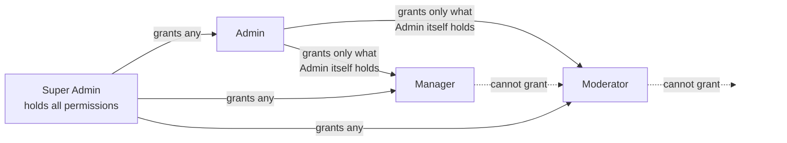

# 00 — Project Overview

← [ROADMAP](../ROADMAP.md) · next → [01 Architecture](01-architecture.md)

---

## 1. Product definition

Guftagu is a **voice-first social networking platform**. Users enter live, multi-seat audio rooms,
talk in real time, send animated virtual gifts, and climb public rankings. Hosts and agencies convert
that attention into earnings; the platform takes a commission. Around that core sit video calling,
gamified events, VIP membership and a creator economy.

The commercial thesis, per SLA §1:

| Driver | Detail |
|---|---|
| Market opportunity | Voice-first social apps growing rapidly across South Asia and the Gulf |
| Creator economy | Hosts and agencies earn through gifting; self-sustaining ecosystem |
| Engagement & retention | Gamification, VIP tiers, events and rankings drive DAU and long sessions |
| Monetisation ready | Configurable coin economy, VIP subscriptions and gifting commissions from launch |

### Feature pillars

- Real-time, multi-seat audio rooms — public and private (password-protected)
- One-to-one and group video calling, plus camera-enabled video seats inside rooms
- Gamified events, tournaments and lucky draws
- Virtual gifting with animated full-screen entrance effects
- Multi-tier VIP membership and profile personalisation
- Wealth (top gifters) and charm (top hosts) ranking systems
- Agency and host management with earnings and payouts

### Platform guarantees

- Verified onboarding via mobile OTP and social sign-in
- Low-latency group voice and video via Agora
- A coin and diamond wallet with recharge and payouts
- Real-time content moderation and safety controls
- Role-wise dashboards with daily, weekly and monthly analytics
- Push, SMS and in-app notifications

---

## 2. Delivery surfaces

| Surface | Stack | Audience | Notes |
|---|---|---|---|
| Mobile app | React Native (Android + iOS) | User / Player / Host | The only mobile app in V1 |
| Admin panel | Vue 3 web | Super Admin, Admin, Manager, Moderator | Responsive; usable on tablet |
| API & realtime | Laravel 12 | — | REST + WebSocket |

> **DEV-01.** The SLA describes a separate Moderator mobile application. It is **not** being built.
> Moderation lives in the admin panel as a permission-gated role. See
> [ROADMAP §6](../ROADMAP.md#6-scope-deviations-from-the-signed-sla).
>
> **CR-01.** The SLA specifies Flutter for the mobile app. It is being built in **React
> Native** on client direction. Nothing about the API, the realtime protocol or the feature
> scope changes — only the client toolchain. Same reference.

---

## 3. Roles and access

Five roles (SLA §2). Note the PDF's role table is column-misaligned in the source; the mapping below
is reconstructed from content and should be confirmed at sign-off — marked *interpreted from scope*.

### 3.1 Super Admin
- Full platform access across all modules and entities
- Manages admins, roles, commissions and global platform settings
- Views consolidated analytics, revenue reports and audit logs
- Approves high-risk actions such as agency/host approvals and large payouts

### 3.2 Admin
- Day-to-day platform management under the Super Admin
- Manages users, rooms, gifts, VIP tiers and finance operations
- Handles escalations raised by Managers and Moderators

### 3.3 Manager
- Operational management of agencies, hosts, events and content
- Monitors host and agency performance against targets
- Raises settlement and campaign requests for Admin approval

### 3.4 Moderator
- Monitors live rooms and enforces content policy *(admin panel — see DEV-01)*
- Mutes, removes or suspends users and closes violating rooms
- Reviews reports and escalates serious issues to Admin

### 3.5 User / Player
- Joins and hosts audio rooms and participates in events
- Sends and receives virtual gifts and climbs the rankings
- Manages profile, wallet, VIP membership and social connections

---

## 4. The permission model

Because the Moderator app is gone, **delegated permissions become the mechanism that makes the admin
panel serve four different roles from one codebase**. This is a first-class feature, not a
configuration detail.

### 4.1 Principles

1. **Permissions are fine-grained and namespaced.** `module.action` — e.g. `rooms.force_close`,
   `users.suspend`, `reports.action`, `wallet.manual_credit`, `payouts.approve`, `gifts.manage`.
   Grouped by module for a usable grant screen.
2. **Super Admin holds everything implicitly.** No row is needed; the check short-circuits.
3. **Delegation is downward-only and bounded.** An Admin may grant a permission to a Moderator **only
   if the Admin itself holds that permission**. Attempting otherwise is refused server-side with
   `403 PERMISSION_ESCALATION_DENIED`. The UI hides the option; the API refuses it anyway. Both.
4. **One source of truth for the UI and the API.** Menus, screens, row-level buttons and route
   middleware all resolve from the same effective-permission set. An ungranted capability is both
   invisible and unreachable.
5. **Scoping where it matters.** A grant can be narrowed — a Moderator restricted to certain room
   categories, a Manager restricted to assigned agencies (which is exactly what FR.B's "assigned
   scope" wording requires).
6. **Everything is logged.** Every grant, revoke and scope change writes to `audit_logs` with actor,
   target, permission, scope, before/after and timestamp.

### 4.2 Delegation chain



| Granter | May grant to | Bounded by |
|---|---|---|
| Super Admin | Admin, Manager, Moderator | nothing — holds all |
| Admin | Manager, Moderator | own effective permission set |
| Manager | — | cannot grant |
| Moderator | — | cannot grant |

### 4.3 Effective permissions

```
effective(user) = permissions(user.role)
                ∪ direct_grants(user)      -- admin_user_permission where effect = 'allow'
                − direct_denies(user)      -- admin_user_permission where effect = 'deny'
```

A direct **deny** always beats a role grant. This lets an Admin remove one capability from a
Moderator without inventing a new role.

Tables in [02 §2](02-database-schema.md#2-identity--access), endpoints in
[03 §5](03-api-contract.md#9-admin--auth-access--permissions), tickets in
[04 A.11](04-epic-backlog.md#a11--role--permission-delegation-added).

---

## 5. End-to-end engagement lifecycle

SLA §4, restated. *(The PDF's workflow table is column-misaligned — actor, action and outcome are
shifted against each other. The sequence below is the reconstructed intent; confirm at sign-off.)*

| Step | Actor | Action | Outcome |
|---:|---|---|---|
| 1 | User | Registers via OTP or social sign-in and sets up a profile | Account created |
| 2 | Host | Creates an audio room with name, category, theme and seat layout | Room published |
| 3 | Host | Shares the room link and invites followers | Audience joins |
| 4 | User | Discovers rooms via explore, search or a shared link | Room joined |
| 5 | User | Takes a seat, chats and sends virtual gifts | Engagement recorded |
| 6 | System | Deducts coins, credits host diamonds and updates rankings | Economy settled |
| 7 | Host | Runs events, games or tournaments in the room | Activity live |
| 8 | User / Host | Recharges the wallet; host requests a diamond-to-cash payout | Wallet updated |
| 9 | Moderator | Monitors rooms, actions reports and enforces policy | Safety maintained |
| 10 | Admin | Reviews analytics, payouts, agencies and disputes | Oversight complete |

---

## 6. Glossary

| Term | Meaning |
|---|---|
| **Coin** | The spend currency. Bought with real money via Razorpay. Never withdrawable. |
| **Diamond** (bean) | The earn currency. Received by hosts when gifted. Convertible to cash via withdrawal, subject to policy. |
| **Wallet** | A user's coin balance and diamond balance. Two separate ledgers, one record. |
| **Room** | A live multi-seat audio space. Public or private (password-protected). |
| **Seat** | A mic position in a room. Occupied, empty, locked or muted. Optionally camera-enabled. |
| **Host** | The room owner. Also a platform status (approved earner), usually under an agency. |
| **Co-host** | A user granted host controls within a specific room. |
| **Raise hand** | A listener's request to be given a seat. |
| **Gift** | A purchasable animated item sent to a user in a room. Costs coins, credits diamonds. |
| **Combo** | Rapid repeated sending of the same gift, rendered as an escalating multiplier. |
| **Entrance effect** | A full-screen animation played when a VIP user or a large gift enters a room. |
| **Wealth level / rank** | Progression and leaderboard driven by coins **spent**. Top gifters. |
| **Charm level / rank** | Progression and leaderboard driven by diamonds **received**. Top hosts. |
| **Level / XP** | General account progression from activity. Distinct from wealth and charm. |
| **VIP** | A paid multi-tier membership granting badges, frames, entrance effects and exclusive gifts. |
| **Agency** | An organisation that recruits and manages hosts, takes a commission cut, receives settlements. |
| **Target** | A monthly performance goal set for a host or agency; drives incentive payouts. |
| **Settlement** | A batched payout of earnings to an agency or host over a period. |
| **Withdrawal** | A user/host request to convert diamonds to cash. |
| **Sanction** | A moderation penalty — warning, mute, temporary ban, permanent ban. |
| **Epic ID** | The SLA's traceability key (A.1 … E.5). Every ticket carries one. |
| **CR** | Change Request. Anything outside this specification, billed at Rs. 475/hour. |

---

## 7. In scope

Everything in the [epic traceability matrix](../ROADMAP.md#5-epic-traceability-matrix) — all 34 SLA
epics plus A.11 — delivered across the mobile app, admin panel and API, on the milestone schedule in
[05](05-sprint-plan.md).

Explicitly included and easy to under-plan:

- Both **English and Hindi**, with the i18n layer built to extend (E.5a)
- **GST-compliant invoice generation** for coin recharges (E.3c)
- **Load testing** for high-concurrency rooms (SLA §5.4a)
- **OpenAPI/Swagger documentation for every endpoint** (SLA §5.1c) — not optional
- **WCAG 2.1 AA alignment** (SLA §5.2c) and accessibility best practice (E.5c)
- **Admin and user manuals** plus a production support runbook (SLA §5.5)
- **Audit logging with timestamps and user attribution** across all admin activity (A.10d)

---

## 8. Out of scope

Not in the SLA, therefore **not** being built in V1. Each is a Change Request at Rs. 475/hour if
wanted. This list is the commercial boundary — keep it current.

| Area | Excluded |
|---|---|
| **Moderator mobile app** | Dropped per DEV-01. Moderation is web-only. |
| **Zoom SDK** | SLA marks it optional; Agora only. |
| **Live streaming video broadcast** | Room video seats and calls only — no one-to-many video broadcast, no RTMP, no external streaming. |
| **Music / audio effects** | No DJ mode, background music library, soundboard, voice changer or karaoke. |
| **AI moderation** | Banned-word lists and human review only. No automated audio transcription, no ML image/NSFW classification, no toxicity scoring. |
| **Games** | "Mini-games" in D.7d means lucky draws and event mechanics driven by the events engine — not bespoke playable games (ludo, teen patti, spin-and-win engines). |
| **Web or desktop user app** | Users are mobile only. The web surface is administrative. |
| **Third-party beauty SDK** | Agora's built-in beautification only (DEV-05). |
| **Additional languages** | English and Hindi only; the framework extends, the translations are a CR. |
| **Crypto / NFT / external wallets** | Razorpay and the internal ledger only. |
| **In-app purchase billing** | Coin recharge via Razorpay. Apple IAP / Google Play Billing is **not** implemented — see the store-review risk in [07 §8](07-devops-deployment.md#8-mobile-release). |
| **Multi-tenancy / white-label** | One platform, one brand. |
| **Data migration** | Greenfield. No import from an existing system. |
| **Marketing site, SEO, app-store creatives** | Not a development deliverable. |
| **Content production** | Gift artwork, animations, frames and badges are supplied by the client (CI-06). |

---

## 9. Non-functional requirements

Derived from SLA §5 and E.4. Each is verified in [06 Testing & QA](06-testing-qa.md).

| # | Requirement | Target | Verified by |
|---|---|---|---|
| NFR-01 | API response time | p95 < 400 ms for reads, < 800 ms for writes | Load test |
| NFR-02 | Room join time | < 2 s from tap to audible | Manual + instrumented |
| NFR-03 | Audio latency | < 400 ms end-to-end (Agora-bound) | Field test |
| NFR-04 | Concurrency | ⚠ CLIENT INPUT (CI-08) — provisional target 5,000 concurrent users / 300 concurrent rooms | Load test |
| NFR-05 | Availability | 99.5% monthly, excluding scheduled maintenance | Monitoring |
| NFR-06 | Encryption | AES-256 at rest, TLS 1.3 in transit | Security review |
| NFR-07 | Auth | OAuth 2.0 / JWT, rate limited | Security review |
| NFR-08 | Compliance | OWASP Top 10; IT Act 2000; DPDPA 2023 | Security review |
| NFR-09 | Accessibility | WCAG 2.1 AA on the admin panel and app | Audit |
| NFR-10 | Financial integrity | Zero balance drift; every movement double-entried and reconcilable | Ledger reconciliation test |

NFR-10 is the one that cannot be relaxed. See the money rules in
[02 §14](02-database-schema.md#15-money-integrity-rules).
