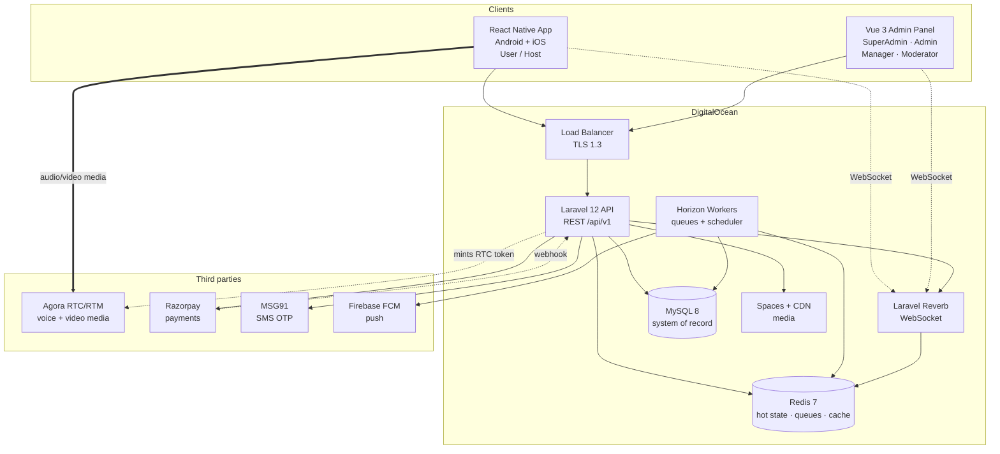
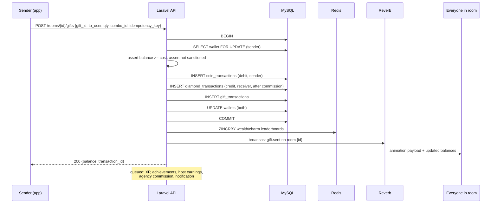

# 01 — Architecture

← [00 Overview](00-overview.md) · next → [02 Database Schema](02-database-schema.md)

---

## 1. System context



**The single most important line in that diagram is the dashed one:** the app talks to Agora directly
for *media only*. Everything else — who is on which seat, who is muted, what gift just flew across the
screen — is the platform's own state, travelling over our WebSocket, authoritative in Redis, durable
in MySQL. See [§4 Realtime strategy](#4-realtime-strategy).

---

## 2. Components

### 2.1 Laravel API (`backend/`)

| Concern | Implementation |
|---|---|
| Framework | Laravel 12, PHP 8.2+ (8.3 in production) |
| HTTP auth | Laravel Sanctum — bearer tokens for mobile, SPA session or bearer for admin |
| Authorisation | Custom permission gate (see [§5](#5-authorisation--the-permission-gate)) |
| Realtime | Laravel Reverb (Pusher protocol) — self-hosted WebSocket server |
| Queues | Redis driver, supervised by Horizon |
| Scheduler | `schedule:work` under Supervisor — leaderboard rolls, target evaluation, settlement batches |
| Validation | Form Requests, one per endpoint |
| Serialisation | API Resources — no raw Eloquent models in responses |
| Docs | `dedoc/scramble` or `l5-swagger` → OpenAPI 3, published at `/api/documentation` |
| Money | `BIGINT` minor units end to end. No floats. Ever. |
| Logging | Structured JSON to stdout, shipped to the log store |

**Module layout** — domain-first, not type-first, so a feature is one folder:

```
backend/app/
├── Domain/
│   ├── Identity/        Auth, OTP, profiles, devices, social
│   ├── Access/          Roles, permissions, delegation, audit
│   ├── Room/            Rooms, seats, members, chat, bans
│   ├── Call/            1:1 and group calls
│   ├── Realtime/        Agora tokens, channel auth, event broadcasting
│   ├── Economy/         Wallets, ledgers, recharge, withdrawals, settlements
│   ├── Gifting/         Gifts, catalogue, sends, combos
│   ├── Progression/     VIP, levels, badges, achievements, check-ins
│   ├── Ranking/         Leaderboards, ranking rules, reward payouts
│   ├── Event/           Events, tournaments, lucky draws
│   ├── Agency/          Agencies, hosts, targets, earnings
│   ├── Moderation/      Reports, sanctions, banned words, moderation logs
│   ├── Social/          Follows, friends, blocks, DMs, posts
│   └── Platform/        Notifications, CMS, banners, settings, i18n, reports
├── Http/
│   ├── Controllers/Api/V1/{Mobile,Admin}/
│   ├── Middleware/
│   ├── Requests/
│   └── Resources/
└── Support/
```

Each `Domain/*` folder holds `Models/`, `Services/`, `Actions/`, `Events/`, `Jobs/`, `Policies/`,
`DTOs/`. Business rules live in Services and Actions — controllers only orchestrate.

### 2.2 Vue admin panel (`admin-web/`)

| Concern | Implementation |
|---|---|
| Framework | Vue 3 `<script setup>`, TypeScript, Vite |
| State | Pinia — `auth`, `permissions`, `rooms`, `notifications` |
| Routing | Vue Router with a permission guard on every route |
| UI | Tailwind + Element Plus (tables, forms, dialogs — the admin workload) |
| Charts | ECharts |
| HTTP | Axios with interceptors — auth header, 401 refresh, error toast, request id |
| Realtime | Laravel Echo over Reverb — live rooms, moderation alerts, KPI tiles |
| i18n | `vue-i18n`, `en` and `hi` |
| Forms | VeeValidate + Zod schemas mirroring the API's validation |
| Config | `.env` (`VITE_` prefixed only), typed in `src/vite-env.d.ts`. Every read has a fallback so a checkout with no `.env` still runs |

**The panel is same-origin with the API and has no base URL of its own.** `VITE_API_BASE_URL`
defaults to the relative `/api/v1`: in development the Vite proxy forwards `/api` to the
backend, and in production one nginx vhost serves both. That is why there is no CORS
configuration anywhere in this project, and why setting an absolute URL here is a change
that requires adding some.

Nothing in `.env` is a secret. It is compiled into the bundle the browser downloads;
credentials are exchanged for a bearer token at runtime and never built in.

Route definitions carry their required permission, and the sidebar is generated from the same table —
so a Moderator's navigation is literally the list of things they may do:

```ts
{ path: '/moderation/reports', component: ReportsQueue,
  meta: { permission: 'reports.view', title: 'nav.reports' } }
```

### 2.3 React Native app (`mobile/`)

> **CR-01.** The SLA and ROADMAP §2 originally resolved the mobile stack to Flutter. It is
> **React Native** on client direction — see
> [ROADMAP §6](../ROADMAP.md#6-scope-deviations-from-the-signed-sla).

| Concern | Implementation |
|---|---|
| Framework | React Native 0.7x, React 18, TypeScript 5 (strict) |
| Toolchain | React Native CLI (bare workflow). **Not Expo Go** — `react-native-agora` ships native modules Expo Go cannot load. Expo prebuild / dev-client is acceptable; plain Expo Go is not |
| State | Zustand for client state, TanStack Query for server state and caching |
| Routing | React Navigation 6 (native-stack + bottom-tabs) with auth and onboarding gates |
| Networking | Axios with an interceptor stack — bearer token, `X-Device-Id`, `X-App-Version`, 401 handling, envelope unwrapping |
| Models | TypeScript types generated from the OpenAPI document; Zod schemas validating at the boundary |
| Realtime | `laravel-echo` + `pusher-js` against Reverb |
| RTC | `react-native-agora` |
| Local | `react-native-keychain` (tokens), MMKV (cache and settings) |
| Animation | `lottie-react-native` for gifts and entrance effects; SVGA through a native module |
| Push | `@react-native-firebase/messaging` + `notifee` |
| i18n | `i18next` + `react-i18next`, `en` and `hi` |

```
mobile/src/
├── core/         config, api client, storage, theme, i18n, errors
├── data/         generated types, endpoints, repositories
├── domain/       entities, repository interfaces, use cases
├── features/     onboarding, home, room, call, gift, wallet, profile,
│                 social, chat, vip, ranking, events, agency, settings
└── shared/       components, hooks, utils
```

Two boundary rules survive the language change, and both matter *more* in TypeScript than
they did in Dart:

- **Nothing outside `data/` sees an API response shape.** Repositories return domain
  entities; the envelope from [03 §2.1](03-api-contract.md#21-response-envelope) is
  unwrapped exactly once, in the interceptor.
- **Generated types are generated, never hand-edited.** A hand-written interface will
  silently drift from the server — the compiler cannot know about a field the backend
  renamed. Regenerating from the OpenAPI document is what catches it, which is why the
  drift check in [07 §3](07-devops-deployment.md) fails the build.

---

## 3. Environments

| Env | Where | Purpose |
|---|---|---|
| **Local** | XAMPP on Windows — Apache/nginx, PHP 8.2, MySQL 8, Redis (running on :6379) | Development |
| **Staging** | DO droplet (2 vCPU / 4 GB), managed MySQL dev, managed Redis dev | Client demos, UAT |
| **Production** | DO LB → 2× app droplets (4 vCPU / 8 GB), managed MySQL (2 vCPU / 4 GB, daily backup + PITR), managed Redis (1 GB), Spaces + CDN | Live |

Provisioning steps, DNS, TLS and secrets in [07 §4](07-devops-deployment.md#4-infrastructure).

---

## 4. Realtime strategy

**The highest-risk design decision in the project.** Get this wrong and M3 overruns.

### 4.1 Division of responsibility

| Carried by **Agora** | Carried by **our WebSocket + Redis** |
|---|---|
| Audio streams | Seat map — who sits where |
| Video streams | Mic muted / unmuted state |
| Active-speaker detection signal | Room member list and presence |
| Noise suppression | In-room chat messages |
| Adaptive bitrate, reconnection | Gift sends and animation triggers |
| Channel join/leave transport | Raise-hand queue |
| — | Host / co-host role changes |
| — | Announcements, pinned messages |
| — | Moderation actions (mute, kick, force-close) |
| — | Room list and "live now" counts |

Agora is a media pipe. It is never the source of truth for application state.

### 4.2 Redis as the authoritative hot store

Room state changes many times per second and must never require a MySQL write on the hot path.

```
room:{roomId}:state        HASH   status, host_id, category, locked, listener_count
room:{roomId}:seats        HASH   seat_no -> {user_id, muted, camera_on, locked, joined_at}
room:{roomId}:members      ZSET   user_id scored by joined_at
room:{roomId}:handraise    ZSET   user_id scored by requested_at
room:{roomId}:speaking     SET    user_ids currently speaking (TTL 3s, refreshed)
presence:user:{userId}     STRING online|in_room:{id}|in_call:{id}   TTL 60s heartbeat
rooms:live                 ZSET   room_id scored by listener_count   (explore ranking)
```

Writes go Redis-first, broadcast immediately, then persist to MySQL asynchronously via a queued job.
Chat messages and gift sends are the exception — gifts hit MySQL **synchronously inside a transaction**
because money moves ([§4.5](#45-the-gift-send-path)).

A reconciliation job rebuilds `room:*` keys from MySQL if Redis is lost; rooms survive a Redis restart
with at most the current speaking-state lost.

### 4.3 Channel taxonomy

| Channel | Type | Who may subscribe | Events |
|---|---|---|---|
| `room.{roomId}` | presence | any member of the room | `seat.updated`, `member.joined`, `member.left`, `chat.message`, `gift.sent`, `handraise.updated`, `room.announcement`, `room.closed`, `user.muted`, `user.kicked` |
| `user.{userId}` | private | that user | `call.incoming`, `call.cancelled`, `notification.new`, `wallet.updated`, `follow.new`, `message.new`, `sanction.applied` |
| `admin.moderation` | private | permission `moderation.live` | `report.created`, `report.escalated`, `room.flagged` |
| `admin.dashboard` | private | permission `dashboard.view` | `kpi.tick` (throttled to 5 s) |
| `agency.{agencyId}` | private | agency members + assigned Managers | `host.joined`, `earning.updated`, `settlement.status` |

Channel authorisation runs through the same permission gate as HTTP — a Moderator without
`moderation.live` cannot subscribe to `admin.moderation`, not merely fail to see the menu item.

### 4.4 Agora token minting

Agora App Certificate never leaves the server.

1. Client calls `POST /api/v1/rooms/{id}/rtc-token` (or `/calls/{id}/rtc-token`).
2. Server verifies the user is entitled to be in that room/call **and is not banned or sanctioned**.
3. Server mints an RTC token — channel = `room_{id}`, uid = the user's numeric Agora uid, role =
   `PUBLISHER` if seated / `SUBSCRIBER` if listening, TTL 3600 s.
4. Client joins the Agora channel with that token.
5. On seat change (listener → speaker) the client requests a **new** token with the publisher role.
   Role is enforced by the token, not by client-side politeness.
6. Token refresh fires at T−300 s via the `onTokenPrivilegeWillExpire` callback.

### 4.5 The gift send path

The most important sequence in the product — it moves money, updates rankings and triggers animation
for every viewer, all at once.



Rules: `SELECT ... FOR UPDATE` on the sender's wallet row; the whole thing in one transaction;
`idempotency_key` unique-indexed so a retried request returns the original result rather than sending
twice. Leaderboards and XP are eventually consistent — balances never are.

### 4.6 Reconnection

| Situation | Behaviour |
|---|---|
| WebSocket drops | Echo auto-reconnects with backoff; on reconnect the client calls `GET /rooms/{id}/state` and replaces local state wholesale. No delta replay. |
| Agora drops | SDK auto-rejoins; app shows "reconnecting"; if it fails for 30 s the user is returned to the room list with a toast. |
| App backgrounded | Audio continues via a foreground service (Android) / background audio mode (iOS). Seat is held. |
| App killed | Heartbeat lapses; after 60 s the server vacates the seat and broadcasts `seat.updated`. |
| Host disconnects | 120 s grace, then co-host is promoted, or the room closes if there is none. |

---

## 5. Authorisation — the permission gate

One gate, used by HTTP middleware, WebSocket channel auth, Vue route guards and Blade/Resource
field visibility.

### 5.1 Resolution

```php
// Domain/Access/Services/PermissionResolver.php
public function effectiveFor(AdminUser $user): Collection
{
    if ($user->isSuperAdmin()) return Permission::allKeys();      // short-circuit

    return Cache::tags(["perm:{$user->id}"])->remember(
        "perm:{$user->id}", 300,
        fn () => $user->role->permissions->pluck('key')
            ->merge($user->directGrants()->allow()->pluck('key'))
            ->diff($user->directGrants()->deny()->pluck('key'))
            ->unique()->values()
    );
}
```

Cache is tagged per user and flushed on any grant, revoke or role change — so a revoked permission
takes effect on the next request, not in five minutes.

### 5.2 Enforcement points

| Layer | Mechanism |
|---|---|
| HTTP route | `->middleware('permission:rooms.force_close')` |
| Controller action | `$this->authorize('forceClose', $room)` for record-level rules |
| WebSocket | `Broadcast::channel('admin.moderation', fn ($u) => $u->can('moderation.live'))` |
| API response | Resources omit fields the caller may not see (e.g. wallet totals) |
| Vue route | `router.beforeEach` checks `meta.permission` against the Pinia store |
| Vue component | `v-permission="'users.suspend'"` directive on buttons |

### 5.3 The escalation guard

The rule that makes delegation safe. Enforced in one place, server-side:

```php
// Domain/Access/Actions/GrantPermission.php
public function handle(AdminUser $granter, AdminUser $target, array $keys, ?array $scope = null): void
{
    if ($granter->is($target)) {
        throw new PermissionException('SELF_GRANT_DENIED');
    }
    if (! $granter->canDelegateTo($target)) {              // SA→any, Admin→{Manager,Moderator}
        throw new PermissionException('DELEGATION_TARGET_DENIED');
    }
    if (! $granter->isSuperAdmin()) {
        $ungranted = collect($keys)->diff($this->resolver->effectiveFor($granter));
        if ($ungranted->isNotEmpty()) {
            throw new PermissionException('PERMISSION_ESCALATION_DENIED', $ungranted->all());
        }
    }
    // …persist, log to audit_logs, flush the target's permission cache
}
```

Tested explicitly: an Admin lacking `payouts.approve` must receive `403
PERMISSION_ESCALATION_DENIED` when granting it to a Moderator, even by direct API call with the UI
bypassed. See [06 §6](06-testing-qa.md#6-security-testing).

### 5.4 Permission catalogue (extract)

Full list in [02 §2.4](02-database-schema.md#24-access-control).

| Module | Keys |
|---|---|
| `dashboard` | `view`, `export` |
| `users` | `view`, `view_pii`, `edit`, `suspend`, `ban`, `kyc_verify`, `level_edit`, `vip_edit` |
| `wallet` | `view`, `manual_credit`, `manual_debit`, `ledger_view` |
| `rooms` | `view`, `monitor_live`, `join_silent`, `feature`, `pin`, `categorise`, `force_close`, `seat_lock`, `theme_manage` |
| `moderation` | `live`, `mute_user`, `kick_user`, `warn_user`, `ban_temp`, `ban_permanent`, `bannedwords_manage`, `logs_view` |
| `reports` | `view`, `action`, `escalate`, `assign` |
| `gifts` | `view`, `manage`, `category_manage`, `drop_manage` |
| `vip` | `view`, `manage` |
| `economy` | `rates_manage`, `packages_manage`, `commission_manage`, `ledger_view`, `reconcile` |
| `payouts` | `view`, `approve`, `reject`, `batch_process` |
| `agency` | `view`, `approve`, `edit`, `target_manage`, `settlement_process` |
| `hosts` | `view`, `approve`, `target_manage`, `earnings_view` |
| `events` | `view`, `manage`, `reward_manage` |
| `rankings` | `view`, `rules_manage`, `reward_payout` |
| `cms` | `banner_manage`, `announcement_manage`, `campaign_send`, `page_manage` |
| `reports_export` | `revenue`, `users`, `hosts`, `transactions` |
| `access` | `admin_manage`, `role_manage`, `permission_grant`, `audit_view` |
| `settings` | `view`, `manage` |

---

## 6. Security architecture

Maps to SLA §5.3 and epic E.4.

| Control | Implementation |
|---|---|
| **RBAC** | [§5](#5-authorisation--the-permission-gate). Every route carries a permission; the default is deny. |
| **At rest** | MySQL and Spaces encrypted (AES-256, DO-managed). Application-level AES-256-GCM on PII columns: phone, email, KYC documents, bank details — via a Laravel `Encrypted` cast with keys in the environment, rotatable. |
| **In transit** | TLS 1.3 only; HSTS with preload; TLS 1.0–1.2 disabled; certificate pinning in the mobile app for the API host (`react-native-ssl-pinning`, or the platform network-security config on Android and ATS on iOS). |
| **API auth** | Sanctum bearer tokens. Access token 24 h, refresh token 30 days, rotated on use. Device-bound — token records `device_id`; a token presented from a different device is revoked. |
| **Rate limiting** | OTP send 3/hour/number and 10/day/IP · login 5/min/IP · gift send 20/min/user · general API 120/min/user · admin 300/min. Redis-backed, returns `429` with `Retry-After`. |
| **OWASP Top 10** | A01 permission gate + object-level checks · A02 above · A03 Eloquent bindings only, no raw interpolation · A04 rate limits, idempotency, wallet row locks · A05 hardened config, debug off, no directory listing · A06 Dependabot + `composer audit` in CI · A07 bcrypt cost 12, MFA for admins, lockout after 5 failures · A08 signed artefacts, integrity-checked deploys · A09 structured audit logs, 1-year retention · A10 no user-supplied URLs fetched server-side. |
| **File upload** | MIME sniffing not trusted; extension allowlist; magic-byte validation; images re-encoded; max 10 MB image / 50 MB audio; stored in Spaces with random keys; served via CDN with signed URLs for private media. |
| **Admin MFA** | Email OTP on login (A.1a), toggleable per sub-role by Super Admin (A.1d). Session timeout configurable (A.1c), default 60 min idle. |
| **Secrets** | Never in the repo. `.env` on servers with `600`, provisioned by the deploy pipeline; `.env.example` committed with keys but no values. |
| **PII minimisation** | Phone numbers masked in all admin lists (`+91 98••••••21`); full value requires `users.view_pii` and writes an audit entry. |

### 6.1 Indian regulatory alignment

| Requirement | Implementation |
|---|---|
| **IT Act 2000 / Intermediary Rules** | Published grievance officer contact; reports actioned within 24 h and resolved within 15 days; takedown workflow with logs; traceability of the originator of flagged content. |
| **DPDPA 2023** | Explicit consent at signup, versioned and recorded; a privacy screen listing what is collected and why; **account deletion** that erases or irreversibly anonymises personal data within 30 days while retaining financial records as law requires; data-export on request; a documented breach-notification procedure; children under 18 not permitted — DOB captured at signup and enforced. |
| **Financial records** | Transaction ledger and GST invoices retained 8 years; never hard-deleted by the deletion flow. |

> ⚠ CLIENT INPUT (CI-05): grievance officer name and contact, legal entity, GST number, and the T&C /
> privacy policy text must be supplied before go-live. The implementation is built; the content is not
> ours to write.

---

## 7. Cross-cutting conventions

| Concern | Convention |
|---|---|
| IDs | `BIGINT UNSIGNED AUTO_INCREMENT` internally; a `uuid` column on user-facing entities for public exposure. Never expose sequential IDs in the mobile API. |
| Timestamps | UTC in the database, always. `created_at` / `updated_at` on every table. Localised at render. |
| Soft deletes | On user-owned and financial-adjacent records. Hard delete only via the DPDPA erasure job. |
| Money | `BIGINT` minor units. Coins and diamonds are integers by nature; INR stored in paise. |
| Enums | MySQL `ENUM` avoided — `VARCHAR` + an application-side enum class, so adding a value is not a schema migration. |
| Pagination | Cursor-based for feeds and chat; offset for admin tables. Default 20, max 100. |
| Idempotency | Required on gift send, recharge order creation, withdrawal request and every webhook. |
| Errors | One envelope, typed codes — [03 §2](03-api-contract.md#2-conventions). |
| Request tracing | `X-Request-Id` generated at the edge, logged everywhere, returned in every response. |
| Feature flags | `settings` table, cached — lets a risky feature ship dark. |

---

## 8. Local development setup

XAMPP on Windows, matching the environment this repo lives in.

```bash
# 1. Backend
cd C:/xampp/htdocs/Guftagoo/backend
composer install
cp .env.example .env && php artisan key:generate
# set DB_*, REDIS_*, AGORA_*, RAZORPAY_*, MSG91_*, FCM_*
php artisan migrate --seed
php artisan storage:link

# 2. Three processes, three terminals
php artisan serve --port=8000     # API
php artisan reverb:start          # WebSocket :8080
php artisan queue:work            # jobs   (or: php artisan horizon)

# 3. Admin panel
cd ../admin-web && npm install
cp .env.example .env              # VITE_API_PROXY_TARGET=http://127.0.0.1:8001
npm run dev                       # :5173

# 4. Mobile
cd ../mobile && npm install
cd ios && pod install && cd ..        # macOS only
cp .env.example .env                  # API_URL=http://10.0.2.2:8000/api/v1 (Android emulator)
                                      # REVERB_HOST=10.0.2.2  REVERB_PORT=8080
npm run android                       # or: npm run ios
```

`10.0.2.2` is the Android emulator's alias for the host machine. An iOS simulator reaches the
host on `localhost`; a physical device needs the machine's LAN IP, and Reverb must then be
started with `REVERB_SERVER_HOST=0.0.0.0` so it is reachable off-loopback.

Prerequisites: PHP 8.2+ with `bcmath`, `gd`, `intl`, `zip` (the `redis` C extension is optional — `predis/predis` is used instead); MySQL 8; Redis 7 (WSL2 or
Memurai); Node 20; Composer 2; JDK 17 + Android SDK 34 (and Xcode 15 + CocoaPods for iOS builds, macOS only).

Seeders create: a Super Admin (`superadmin@guftagu.local` / `Password@123`, **development only**), one
Admin, one Manager, one Moderator with a deliberately partial permission set, the full permission
catalogue, room categories, gift catalogue, VIP tiers, recharge packages and 50 demo users.
