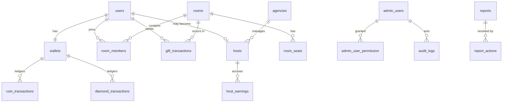

# 02 — Database Schema

← [01 Architecture](01-architecture.md) · next → [03 API Contract](03-api-contract.md)

**Engine:** MySQL 8.0 · InnoDB · `utf8mb4_unicode_ci`
**Conventions:** [01 §7](01-architecture.md#7-cross-cutting-conventions) — UTC timestamps, `BIGINT`
minor units for money, `VARCHAR` + app enums, soft deletes where noted.

Every table below translates 1:1 into a Laravel migration. Column shorthand:
`id` = `BIGINT UNSIGNED AUTO_INCREMENT PK`, `fk` = `BIGINT UNSIGNED` with a foreign key,
`ts` = `TIMESTAMP NULL`, `stamps` = `created_at` + `updated_at`, `softdel` = `deleted_at`.

---

## 1. Domain map



**100 application tables across 13 domains**, plus Laravel's stock tables (`jobs`, `failed_jobs`,
`job_batches`, `cache`, `sessions`).

---

## 2. Identity & access

### 2.1 `users` — the mobile-app account

| Column | Type | Notes |
|---|---|---|
| `id` | id | |
| `uuid` | CHAR(36) | unique; the only id exposed to the mobile API |
| `guftagu_id` | VARCHAR(12) | unique, human-shareable, e.g. `GF8420156` |
| `phone` | VARBINARY(255) | AES-256-GCM encrypted (D.1a) |
| `phone_hash` | CHAR(64) | SHA-256, unique — lookup key, since ciphertext is not searchable |
| `country_code` | VARCHAR(5) | default `+91` |
| `email` | VARBINARY(255) | nullable, encrypted |
| `email_hash` | CHAR(64) | nullable, unique |
| `password` | VARCHAR(255) | nullable — OTP-only accounts have none |
| `status` | VARCHAR(20) | `active` `suspended` `banned` `deleted` |
| `agora_uid` | INT UNSIGNED | unique, generated once; Agora requires a numeric uid |
| `last_active_at` | ts | |
| `registered_ip` | VARCHAR(45) | |
| `consent_version` | VARCHAR(20) | DPDPA — which T&C version was accepted |
| `consent_at` | ts | |
| stamps, softdel | | |

Indexes: `phone_hash`, `email_hash`, `guftagu_id`, `uuid`, `status`, `last_active_at`.

### 2.2 `user_profiles` (D.1b–d)

| Column | Type | Notes |
|---|---|---|
| `id` / `user_id` | id / fk unique | |
| `display_name` | VARCHAR(50) | |
| `avatar_url` / `cover_url` | VARCHAR(500) | Spaces CDN |
| `bio` | VARCHAR(300) | |
| `gender` | VARCHAR(20) | `male` `female` `other` `undisclosed` |
| `date_of_birth` | DATE | 18+ enforced at signup |
| `country` / `city` | VARCHAR(80) | |
| `language` | VARCHAR(5) | `en` `hi` |
| `theme` | VARCHAR(10) | `light` `dark` `system` |
| `privacy` | JSON | `{show_online, allow_dm, allow_calls, show_wealth_rank, …}` |
| `notification_prefs` | JSON | per-category on/off |
| `is_profile_complete` | BOOL | |
| stamps | | |

### 2.3 Supporting identity tables

| Table | Purpose | Key columns |
|---|---|---|
| `otp_verifications` | OTP issue/verify (D.1a, E.2b) | `phone_hash`, `otp_hash`, `purpose` (`login` `register` `withdrawal` `phone_change`), `attempts`, `expires_at`, `verified_at`, `ip` |
| `social_accounts` | Google / Apple (D.1a) | `user_id`, `provider`, `provider_user_id` (unique with provider), `email`, `raw` JSON |
| `devices` | Push targeting, device-bound tokens | `user_id`, `device_id` unique, `platform`, `fcm_token`, `app_version`, `os_version`, `last_seen_at`, `is_active` |
| `personal_access_tokens` | Sanctum (stock) plus a `device_id` column | |
| `user_kyc` | KYC for withdrawal (A.3b) | `user_id`, `full_name`, `doc_type`, `doc_number` (enc), `doc_front_url`, `doc_back_url`, `selfie_url`, `pan` (enc), `bank_account` (enc), `ifsc`, `upi_id`, `status` (`pending` `verified` `rejected`), `reviewed_by`, `reviewed_at`, `rejection_reason` |
| `admin_users` | Panel accounts | `name`, `email` unique, `password`, `role_id`, `avatar_url`, `phone`, `mfa_enabled`, `mfa_secret`, `session_timeout_minutes`, `status`, `last_login_at`, `last_login_ip`, `created_by` |

`admin_users` is deliberately **separate** from `users`. Panel staff and app users share no lifecycle,
no auth path and no threat model. Merging them is how privilege bugs get written.

### 2.4 Access control

| Table | Columns | Notes |
|---|---|---|
| `roles` | `id`, `key` unique (`super_admin` `admin` `manager` `moderator`), `name`, `description`, `is_system` | System roles cannot be deleted |
| `permissions` | `id`, `key` unique (`rooms.force_close`), `module`, `action`, `name`, `description`, `risk_level` (`low` `medium` `high`) | Seeded. Granting a `high` permission requires MFA re-entry |
| `role_permission` | `role_id` fk, `permission_id` fk | Composite PK — the role baseline |
| `admin_user_permission` | `admin_user_id` fk, `permission_id` fk, `effect` (`allow` `deny`), `granted_by` fk, `expires_at` ts, `scope` JSON | Unique (`admin_user_id`,`permission_id`). Direct grants **and** explicit denies |
| `permission_grants_log` | `actor_id`, `target_id`, `permission_id`, `action` (`grant` `revoke` `scope_change` `deny`), `effect_before`, `effect_after`, `scope`, `reason`, `ip`, `created_at` | Append-only. Never updated, never deleted |

`scope` JSON — how a Moderator or Manager is narrowed:

```json
{
  "room_categories": [3, 7],
  "agencies": [12],
  "shift": { "from": "18:00", "to": "02:00", "tz": "Asia/Kolkata" }
}
```

Absent or empty `scope` means unrestricted within that permission.

#### Permission catalogue

18 modules, 79 keys — full list in [01 §5.4](01-architecture.md#54-permission-catalogue-extract). Seeded by
`PermissionSeeder`; adding one is a seeder change, removing one requires a data migration that revokes
it everywhere first.

**Role baselines** (what `role_permission` seeds — everything else is granted individually):

| Role | Baseline |
|---|---|
| `super_admin` | all, by short-circuit — no rows |
| `admin` | all except `access.role_manage`, `settings.manage`, `economy.rates_manage` |
| `manager` | `dashboard.view`, `agency.*` (not `settlement_process`), `hosts.*` (not `approve`), `events.view`/`manage`, `cms.banner_manage`, `reports_export.*`, `rooms.view`/`monitor_live`, `users.view` |
| `moderator` | `rooms.view`, `rooms.monitor_live`, `rooms.join_silent`, `reports.view`, `moderation.logs_view` — **deliberately thin.** Everything a Moderator actually does (`moderation.mute_user`, `kick_user`, `ban_temp`, `rooms.force_close`, `reports.action`) is granted individually by a Super Admin or an Admin. That is the whole point of the delegation model. |

---

## 3. Rooms

### 3.1 `rooms` (D.2a, A.4)

| Column | Type | Notes |
|---|---|---|
| `id` / `uuid` | id / CHAR(36) | |
| `room_code` | VARCHAR(12) | unique, shareable |
| `owner_id` | fk users | |
| `category_id` | fk room_categories | |
| `theme_id` | fk room_themes | nullable |
| `name` | VARCHAR(80) | banned-word checked |
| `description` | VARCHAR(300) | |
| `cover_url` | VARCHAR(500) | |
| `announcement` | VARCHAR(500) | D.2e |
| `visibility` | VARCHAR(10) | `public` `private` |
| `password_hash` | VARCHAR(255) | nullable — private rooms (D.2a) |
| `seat_count` | TINYINT | 5, 8, 9, 12, 15 |
| `seat_layout` | VARCHAR(20) | `classic` `party` `podium` `dating` |
| `video_enabled` | BOOL | camera seats (D.5b) |
| `status` | VARCHAR(20) | `live` `idle` `closed` `force_closed` |
| `is_featured` / `is_pinned` | BOOL | A.4b |
| `featured_until` | ts | |
| `listener_count` | INT | denormalised from Redis every 10 s |
| `peak_listeners` | INT | |
| `total_diamonds_received` | BIGINT | room rankings (D.8c) |
| `started_at` / `ended_at` | ts | |
| `closed_by` | fk admin_users | A.4c |
| `close_reason` | VARCHAR(255) | |
| stamps, softdel | | |

Indexes: (`status`,`is_featured`), (`category_id`,`status`), `owner_id`, `room_code`,
`listener_count DESC`.

### 3.2 Room supporting tables

| Table | Purpose | Key columns |
|---|---|---|
| `room_categories` | A.4b | `key`, `name_en`, `name_hi`, `icon_url`, `sort_order`, `is_active` |
| `room_themes` | A.4d | `name`, `background_url`, `preview_url`, `is_premium`, `required_vip_tier_id`, `coin_price`, `is_active` |
| `room_seats` | D.2b — durable mirror of Redis | `room_id`, `seat_number`, `user_id` null, `is_locked`, `is_muted_by_host`, `is_camera_on`, `occupied_at`. Unique (`room_id`,`seat_number`) |
| `room_members` | presence history | `room_id`, `user_id`, `role` (`owner` `co_host` `speaker` `listener`), `joined_at`, `left_at`, `duration_seconds`, `is_active`. Index (`room_id`,`is_active`) |
| `room_messages` | D.2d in-room chat | `room_id`, `user_id`, `type` (`text` `emoji` `system` `gift` `join`), `body`, `meta` JSON, `is_pinned`, `is_deleted`, `deleted_by`, `created_at`. **Monthly partitions** |
| `room_bans` | per-room bans | `room_id`, `user_id`, `banned_by`, `reason`, `expires_at` |
| `room_invites` | D.2e | `room_id`, `inviter_id`, `token` unique, `channel`, `clicks`, `joins`, `expires_at` |
| `room_handraises` | D.2c | `room_id`, `user_id`, `status` (`pending` `accepted` `rejected` `withdrawn`), `requested_at`, `resolved_at`, `resolved_by` |

`room_messages` grows fastest of any table: monthly `RANGE` partitioning on `created_at`, partitions
older than 6 months exported to Spaces and dropped ([§16](#17-retention--archival)).

---

## 4. Calls (D.5)

| Table | Key columns |
|---|---|
| `calls` | `uuid`, `type` (`voice` `video`), `mode` (`one_to_one` `group`), `initiator_id`, `agora_channel` unique, `status` (`ringing` `ongoing` `ended` `missed` `declined` `cancelled` `failed`), `started_at`, `answered_at`, `ended_at`, `duration_seconds`, `end_reason` |
| `call_participants` | `call_id`, `user_id`, `status` (`invited` `ringing` `joined` `left` `declined` `missed`), `joined_at`, `left_at`, `camera_on`, `mic_on`, `network_quality_avg`. Unique (`call_id`,`user_id`) |

A transition to `missed` enqueues the missed-call push (D.5e).

---

## 5. Economy

The financial core. Read [§15 Money integrity rules](#15-money-integrity-rules) before touching any of
it.

### 5.1 `wallets`

| Column | Type | Notes |
|---|---|---|
| `id` / `user_id` | id / fk unique | |
| `coin_balance` | BIGINT UNSIGNED | spend currency |
| `diamond_balance` | BIGINT UNSIGNED | earn currency, withdrawable |
| `frozen_coins` | BIGINT UNSIGNED | held during a pending operation |
| `frozen_diamonds` | BIGINT UNSIGNED | held against a pending withdrawal |
| `lifetime_coins_purchased` | BIGINT UNSIGNED | |
| `lifetime_coins_spent` | BIGINT UNSIGNED | drives wealth level |
| `lifetime_diamonds_earned` | BIGINT UNSIGNED | drives charm level |
| `lifetime_withdrawn_paise` | BIGINT UNSIGNED | |
| `is_frozen` | BOOL | admin freeze (A.3) |
| `version` | INT | optimistic-lock counter |
| stamps | | |

### 5.2 Ledgers — `coin_transactions`, `diamond_transactions`

Identical shape, **two separate tables** so the currencies can never be confused in a query.

| Column | Type | Notes |
|---|---|---|
| `id` / `uuid` | id / CHAR(36) | |
| `wallet_id` / `user_id` | fk | |
| `direction` | VARCHAR(6) | `credit` `debit` |
| `amount` | BIGINT UNSIGNED | always positive; `direction` carries the sign |
| `balance_before` / `balance_after` | BIGINT UNSIGNED | **audit anchor** — makes drift detectable |
| `type` | VARCHAR(40) | `recharge` `gift_sent` `gift_received` `vip_purchase` `theme_purchase` `event_entry` `event_reward` `ranking_reward` `daily_checkin` `admin_credit` `admin_debit` `refund` `withdrawal_hold` `withdrawal_settled` `withdrawal_reverted` `commission` `conversion` |
| `reference_type` / `reference_id` | VARCHAR(40) / BIGINT | polymorphic link to the causing record |
| `idempotency_key` | VARCHAR(64) | nullable, **unique** |
| `performed_by` | fk admin_users | set for manual adjustments (A.3d) |
| `note` | VARCHAR(255) | mandatory for admin adjustments |
| `created_at` | ts | **no `updated_at` — ledger rows are immutable** |

Indexes: (`user_id`,`created_at`), (`type`,`created_at`), `idempotency_key`,
(`reference_type`,`reference_id`).

### 5.3 Recharge & payments (E.3, A.7)

| Table | Key columns |
|---|---|
| `recharge_packages` | `name`, `coins`, `bonus_coins`, `price_paise`, `currency`, `is_first_purchase_only`, `is_active`, `sort_order`, `badge_text`, `valid_from`, `valid_to` · ⚠ CI-01 |
| `conversion_rates` | `key` (`coin_to_diamond`, `diamond_to_inr`), `rate_numerator`, `rate_denominator`, `effective_from`, `effective_to`, `set_by` — rational, never float · ⚠ CI-01 |
| `orders` | `uuid`, `user_id`, `package_id`, `coins`, `bonus_coins`, `amount_paise`, `tax_paise`, `total_paise`, `currency`, `status` (`created` `pending` `paid` `failed` `expired` `refunded`), `gateway`, `gateway_order_id`, `idempotency_key` unique, `expires_at` |
| `payments` | `order_id`, `gateway_payment_id` unique, `method` (`upi` `card` `netbanking` `wallet`), `amount_paise`, `fee_paise`, `tax_paise`, `status`, `captured_at`, `failure_code`, `failure_reason`, `raw_response` JSON |
| `payment_webhooks` | `gateway`, `event_id` unique, `event_type`, `signature`, `payload` JSON, `status` (`received` `processed` `failed` `ignored`), `processed_at`, `attempts`, `error` — **store raw first, process second** |
| `invoices` | `invoice_number` unique (`GFT/2026-27/000123`), `order_id`, `user_id`, `billing_name`, `gstin`, `place_of_supply`, `taxable_paise`, `cgst_paise`, `sgst_paise`, `igst_paise`, `total_paise`, `pdf_url`, `issued_at` — E.3c, sequential and gapless per financial year |
| `refunds` | `payment_id`, `amount_paise`, `reason`, `gateway_refund_id`, `status`, `initiated_by`, `processed_at` |

### 5.4 Withdrawals & settlements (A.7b–c, D.6d)

| Table | Key columns |
|---|---|
| `withdrawals` | `uuid`, `user_id`, `diamonds`, `gross_paise`, `commission_paise`, `tds_paise`, `net_paise`, `method` (`bank` `upi`), `payout_details` JSON (encrypted), `status` (`pending` `approved` `rejected` `processing` `paid` `failed` `reverted`), `requested_at`, `reviewed_by`, `reviewed_at`, `rejection_reason`, `batch_id`, `utr`, `paid_at` · ⚠ CI-03 |
| `payout_batches` | `batch_number`, `type` (`user_withdrawal` `agency_settlement` `ranking_reward`), `count`, `total_paise`, `status` (`draft` `approved` `processing` `completed` `partial` `failed`), `created_by`, `approved_by`, `approved_at`, `processed_at`, `file_url` |
| `commission_slabs` | `applies_to` (`platform` `agency` `host`), `agency_id` null, `metric` (`diamonds_earned` `coins_spent`), `min_value`, `max_value`, `percentage_bp` INT, `effective_from`, `effective_to` · ⚠ CI-02 |
| `settlements` | `agency_id`, `period_start`, `period_end`, `gross_diamonds`, `platform_cut_paise`, `agency_cut_paise`, `host_cut_paise`, `net_payable_paise`, `status` (`draft` `manager_raised` `admin_approved` `paid` `rejected`), `raised_by`, `approved_by`, `batch_id`, `notes` — B.2c → A.8d |

Commission is stored as **integer basis points** (`percentage_bp = 1250` → 12.50%). A float rate is
how you lose a rupee per thousand transactions and cannot explain where it went.

---

## 6. Gifting (D.6, A.6)

| Table | Key columns |
|---|---|
| `gift_categories` | `key`, `name_en`, `name_hi`, `icon_url`, `sort_order`, `is_active` |
| `gifts` | `code` unique, `name_en`, `name_hi`, `category_id`, `tier` (`basic` `premium` `luxury` `legendary`), `coin_price`, `diamond_value`, `thumbnail_url`, `animation_url`, `animation_type` (`lottie` `svga` `mp4`), `duration_ms`, `is_fullscreen`, `is_combo_enabled`, `max_combo`, `required_vip_tier_id`, `is_limited`, `stock`, `available_from`, `available_to`, `is_active`, `sort_order` · ⚠ CI-06 |
| `gift_transactions` | `uuid`, `sender_id`, `receiver_id`, `room_id` null, `call_id` null, `gift_id`, `quantity`, `combo_count`, `combo_group` CHAR(36), `coin_cost` BIGINT, `diamond_credit` BIGINT, `platform_commission_bp`, `agency_id` null, `agency_commission_paise`, `idempotency_key` unique, `created_at`. Indexes (`receiver_id`,`created_at`), (`room_id`,`created_at`), (`sender_id`,`created_at`) |
| `entrance_effects` | `name`, `animation_url`, `animation_type`, `duration_ms`, `trigger` (`vip_entry` `big_gift` `level_up` `event`), `required_vip_tier_id`, `min_gift_coin_value`, `is_active` |

A combo is **many rows sharing a `combo_group`** — each send is its own money movement, rendered as
one escalating animation. Never one row with a mutable counter.

---

## 7. VIP & progression (D.7, A.6c)

| Table | Key columns |
|---|---|
| `vip_tiers` | `level` unique, `name_en`, `name_hi`, `badge_url`, `frame_url`, `entrance_effect_id`, `monthly_price_paise`, `quarterly_price_paise`, `yearly_price_paise`, `coin_price`, `privileges` JSON, `is_active` · ⚠ CI-02 |
| `user_vip_subscriptions` | `user_id`, `tier_id`, `started_at`, `expires_at`, `auto_renew`, `source` (`purchase` `gift` `admin` `event`), `order_id`, `status` (`active` `expired` `cancelled`). Index (`user_id`,`status`), (`expires_at`) |
| `levels` | `type` (`account` `wealth` `charm`), `level`, `min_points` BIGINT, `icon_url`, `rewards` JSON. Unique (`type`,`level`) |
| `user_levels` | `user_id`, `type`, `level`, `points` BIGINT. Unique (`user_id`,`type`) |
| `badges` | `key`, `name_en`, `name_hi`, `icon_url`, `description`, `criteria` JSON, `is_auto_awarded` |
| `user_badges` | `user_id`, `badge_id`, `awarded_at`, `awarded_by`, `is_displayed`. Unique pair |
| `frames` | `name`, `image_url`, `animation_url`, `source` (`vip` `event` `purchase` `admin`), `coin_price`, `required_vip_tier_id`, `is_active` |
| `user_frames` | `user_id`, `frame_id`, `acquired_at`, `expires_at`, `is_equipped` |
| `achievements` | `key`, `name_en`, `name_hi`, `icon_url`, `criteria` JSON, `reward_type`, `reward_value`, `is_active` |
| `user_achievements` | `user_id`, `achievement_id`, `progress`, `target`, `completed_at`, `claimed_at` |
| `daily_checkins` | `user_id`, `checkin_date` DATE, `streak_day`, `reward_type`, `reward_value`. Unique (`user_id`,`checkin_date`) |
| `checkin_rewards` | `streak_day` unique, `reward_type` (`coins` `frame` `badge` `vip_days`), `reward_value`, `icon_url` |

Wealth points = lifetime coins **spent**. Charm points = lifetime diamonds **earned**. Account XP
accrues from activity. Three progressions, three rows per user in `user_levels`.

---

## 8. Rankings (D.8, A.9c–d)

| Table | Key columns |
|---|---|
| `ranking_rules` | `key` (`wealth_daily`, `charm_weekly`, `room_monthly`, `agency_monthly`), `board_type`, `period` (`daily` `weekly` `monthly` `all_time`), `metric`, `min_threshold`, `top_n`, `reset_cron`, `is_active` |
| `leaderboard_snapshots` | `rule_key`, `period_start`, `period_end`, `rank`, `entity_type` (`user` `room` `agency`), `entity_id`, `score` BIGINT. Unique (`rule_key`,`period_start`,`rank`) |
| `ranking_rewards` | `rule_key`, `rank_from`, `rank_to`, `reward_type`, `reward_value`, `is_active` |
| `ranking_reward_payouts` | `snapshot_id`, `user_id`, `reward_type`, `reward_value`, `status` (`pending` `paid` `failed`), `paid_at`, `transaction_id` — A.9d |

Live boards are served from Redis sorted sets (`lb:wealth:daily:20260831`) — zero database reads. A
scheduled job snapshots the ZSET into `leaderboard_snapshots` at period close, then pays rewards. The
snapshot is the record; Redis is the working surface.

---

## 9. Events & games (D.7d, A.9, B.3a)

| Table | Key columns |
|---|---|
| `events` | `uuid`, `type` (`event` `tournament` `lucky_draw`), `title_en`, `title_hi`, `description`, `banner_url`, `rules` JSON, `entry_type` (`free` `coins` `invite`), `entry_cost`, `eligibility` JSON, `starts_at`, `ends_at`, `status` (`draft` `scheduled` `live` `ended` `cancelled`), `created_by`, `approved_by`, `max_participants`, `is_featured` |
| `event_participants` | `event_id`, `user_id`, `joined_at`, `score` BIGINT, `rank`, `status` (`joined` `disqualified` `winner`). Unique pair |
| `event_rewards` | `event_id`, `rank_from`, `rank_to`, `reward_type`, `reward_value`, `quantity`, `claimed_count` |
| `event_reward_claims` | `event_id`, `user_id`, `reward_id`, `status`, `claimed_at`, `transaction_id` |
| `lucky_draws` | `event_id`, `draw_at`, `prize_pool` JSON, `winner_count`, `algorithm` (`random` `weighted`), `seed_hash`, `drawn_at`, `result` JSON |
| `tournaments` | `event_id`, `format` (`leaderboard` `bracket`), `rounds`, `current_round`, `bracket` JSON |

`lucky_draws.seed_hash` is published **before** the draw and the seed revealed after — provable
fairness, which matters when real money bought the entry.

---

## 10. Agency & hosts (D.9a, A.8, B.2)

| Table | Key columns |
|---|---|
| `agencies` | `uuid`, `code` unique, `name`, `owner_user_id`, `logo_url`, `description`, `contact_phone` (enc), `contact_email` (enc), `documents` JSON, `commission_bp`, `status` (`pending` `approved` `suspended` `rejected`), `approved_by`, `approved_at`, `rejection_reason`, `managed_by` fk admin_users |
| `hosts` | `user_id` unique, `agency_id` null, `status` (`pending` `approved` `suspended` `rejected` `left`), `applied_at`, `approved_by`, `approved_at`, `tier`, `base_commission_bp`, `contract_start`, `contract_end`, `notes` |
| `agency_members` | `agency_id`, `user_id`, `role` (`owner` `manager` `host`), `joined_at`, `left_at`, `is_active` |
| `host_targets` | `host_id`, `period_start`, `period_end`, `target_diamonds`, `target_hours`, `target_days`, `achieved_diamonds`, `achieved_hours`, `achieved_days`, `achievement_pct`, `incentive_paise`, `status`. Unique (`host_id`,`period_start`) |
| `host_earnings` | `host_id`, `date` DATE, `diamonds_earned`, `gross_paise`, `platform_cut_paise`, `agency_cut_paise`, `net_paise`, `room_hours`, `gift_count`, `unique_gifters`. Unique (`host_id`,`date`) — the daily rollup every earnings screen reads |
| `host_applications` | `user_id`, `agency_id`, `intro_audio_url`, `experience`, `status`, `reviewed_by`, `reviewed_at`, `reason` |

---

## 11. Moderation (FR.C, A.5)

| Table | Key columns |
|---|---|
| `reports` | `uuid`, `reporter_id`, `target_type` (`user` `room` `message` `post` `profile`), `target_id`, `category` (`abuse` `nudity` `harassment` `spam` `fraud` `underage` `other`), `description`, `evidence_urls` JSON, `audio_clip_url`, `priority` (`low` `medium` `high` `critical`), `status` (`open` `assigned` `actioned` `dismissed` `escalated`), `assigned_to`, `assigned_at`, `resolved_by`, `resolved_at`, `resolution_note`, `escalated_to`, `escalated_at`. Index (`status`,`priority`,`created_at`) |
| `report_actions` | `report_id`, `admin_user_id`, `action` (`warn` `mute` `kick` `ban_temp` `ban_permanent` `content_remove` `room_close` `dismiss` `escalate`), `duration_minutes`, `note`, `created_at` |
| `user_sanctions` | `user_id`, `type` (`warning` `mute` `room_ban` `temp_ban` `permanent_ban` `shadow_ban`), `scope` (`global` `room`), `room_id` null, `reason`, `report_id` null, `issued_by`, `starts_at`, `expires_at`, `revoked_by`, `revoked_at`, `is_active`. Index (`user_id`,`is_active`) |
| `banned_words` | `word`, `language`, `severity` (`block` `flag` `replace`), `replacement`, `scope` JSON (`room_name` `chat` `bio` `dm`), `is_regex`, `is_active`, `created_by` — A.5a |
| `moderation_logs` | `admin_user_id`, `action`, `target_type`, `target_id`, `room_id` null, `before` JSON, `after` JSON, `reason`, `ip`, `created_at`. Append-only — C.4c |
| `content_flags` | `content_type`, `content_id`, `flagged_by` (`system` `user` `moderator`), `rule_matched`, `confidence`, `status`, `reviewed_by`, `reviewed_at` |

---

## 12. Social & messaging (D.3, D.4)

| Table | Key columns |
|---|---|
| `follows` | `follower_id`, `following_id`, `created_at`. Unique pair; indexed both directions |
| `friendships` | `user_id`, `friend_id`, `status` (`pending` `accepted` `blocked`), `requested_by`, `accepted_at`. Unique pair |
| `blocks` | `blocker_id`, `blocked_id`, `reason`. Unique pair — D.9c |
| `conversations` | `uuid`, `type` (`direct` `group`), `title`, `avatar_url`, `created_by`, `last_message_at`, `is_active` |
| `conversation_participants` | `conversation_id`, `user_id`, `role`, `joined_at`, `left_at`, `last_read_message_id`, `is_muted`, `unread_count` |
| `messages` | `uuid`, `conversation_id`, `sender_id`, `type` (`text` `image` `audio` `video` `gift` `system`), `body`, `media_url`, `media_meta` JSON, `reply_to_id`, `is_deleted`, `deleted_for` JSON, `created_at`. **Monthly partitions** |
| `message_reads` | `message_id`, `user_id`, `read_at` |
| `posts` | `uuid`, `user_id`, `type` (`text` `image` `audio`), `body`, `media_urls` JSON, `visibility` (`public` `followers` `private`), `like_count`, `comment_count`, `is_hidden`, `hidden_by` — D.3d, **descope lever #1** |
| `post_likes` | `post_id`, `user_id`. Unique pair |
| `post_comments` | `post_id`, `user_id`, `parent_id`, `body`, `is_deleted` |
| `user_visits` | `visitor_id`, `profile_id`, `visited_at` — profile-visitor list |

---

## 13. Platform

| Table | Key columns |
|---|---|
| `notifications` | `user_id` null, `admin_user_id` null, `type`, `title`, `body`, `data` JSON, `image_url`, `deep_link`, `channel` (`push` `in_app` `sms` `email`), `is_read`, `read_at`, `sent_at`. Index (`user_id`,`is_read`,`created_at`) |
| `notification_templates` | `key` unique, `title_en`, `title_hi`, `body_en`, `body_hi`, `channels` JSON, `variables` JSON, `is_active` |
| `broadcasts` | `title`, `body`, `image_url`, `deep_link`, `audience` (`all` `role` `segment` `user_list`), `audience_filter` JSON, `channels` JSON, `scheduled_at`, `status`, `sent_count`, `delivered_count`, `opened_count`, `created_by`, `approved_by` — A.10a, E.2c |
| `banners` | `title`, `image_url`, `placement` (`home_top` `room_list` `wallet` `event`), `action_type`, `action_value`, `sort_order`, `starts_at`, `ends_at`, `is_active`, `click_count`, `created_by`, `approved_by` — A.10a, B.3b |
| `announcements` | `title_en/hi`, `body_en/hi`, `type` (`marquee` `popup` `banner`), `target_roles` JSON, `starts_at`, `ends_at`, `is_active` |
| `cms_pages` | `slug` unique, `title_en/hi`, `content_en/hi` LONGTEXT, `type` (`terms` `privacy` `faq` `about` `guidelines` `help`), `version`, `is_published`, `published_at` |
| `faqs` | `category`, `question_en/hi`, `answer_en/hi`, `sort_order`, `is_active` |
| `support_tickets` | `uuid`, `user_id`, `category`, `subject`, `description`, `attachments` JSON, `priority`, `status`, `assigned_to`, `resolved_at`, `resolution` — D.9d, B.4a |
| `support_ticket_messages` | `ticket_id`, `sender_type`, `sender_id`, `body`, `attachments` JSON |
| `audit_logs` | `admin_user_id`, `action`, `module`, `entity_type`, `entity_id`, `before` JSON, `after` JSON, `ip`, `user_agent`, `request_id`, `created_at`. Append-only — A.10d |
| `settings` | `key` unique, `value` TEXT, `type` (`string` `int` `bool` `json`), `group`, `is_public`, `description`, `updated_by`. Cached; feature flags live here |
| `translations` | `locale`, `group`, `key`, `value`. Unique triple — E.5a |
| `report_exports` | `admin_user_id`, `type`, `filters` JSON, `format` (`pdf` `csv` `xlsx`), `status`, `file_url`, `row_count`, `expires_at` — A.10c, always a queued job |
| `jobs`, `failed_jobs`, `job_batches`, `cache`, `sessions` | Laravel stock |

---

## 14. Indexing strategy

Beyond the per-table indexes listed above, these composites carry the hot queries:

| Query | Index |
|---|---|
| Explore — live public rooms by popularity | `rooms(status, visibility, listener_count DESC)` |
| Explore by category | `rooms(category_id, status, listener_count DESC)` |
| A user's transaction history | `coin_transactions(user_id, created_at DESC)` |
| Gift income for a host | `gift_transactions(receiver_id, created_at DESC)` |
| Room gift feed | `gift_transactions(room_id, created_at DESC)` |
| Moderation queue | `reports(status, priority, created_at)` |
| Active sanctions check (on every room join) | `user_sanctions(user_id, is_active, expires_at)` |
| Follower list | `follows(following_id, created_at DESC)` |
| Unread notification count | `notifications(user_id, is_read)` |
| Pending withdrawals | `withdrawals(status, requested_at)` |
| Host daily earnings | `host_earnings(host_id, date DESC)` |
| Admin audit search | `audit_logs(admin_user_id, created_at DESC)`, `audit_logs(module, created_at DESC)` |

The sanctions check runs on every room join, every chat message and every gift send — if only one
index is right, make it that one.

---

## 15. Money integrity rules

Non-negotiable. NFR-10 depends entirely on these.

1. **Integers only.** Coins and diamonds are `BIGINT` counts; INR is `BIGINT` paise. No `FLOAT`, no
   `DOUBLE` in currency arithmetic. Commission is integer basis points.
2. **Every movement is a ledger row.** A balance never changes without a matching
   `coin_transactions` / `diamond_transactions` insert **in the same transaction**. `wallets` is a
   cached projection of the ledger, not the truth.
3. **Ledger rows are immutable.** No `UPDATE`, no `DELETE`, no `updated_at`. A mistake is corrected by
   a compensating entry, never by editing history.
4. **`balance_before` and `balance_after` on every row.** For any user ordered by `id`, each row's
   `balance_before` must equal the previous row's `balance_after`, and the final `balance_after` must
   equal `wallets.coin_balance`. The nightly job asserts exactly that and alerts on mismatch.
5. **Row-level locking.** `SELECT … FROM wallets WHERE user_id = ? FOR UPDATE` before any balance read
   that precedes a write. Always. Two concurrent gift sends must not both read the same balance.
6. **One transaction, both sides.** Debit the sender and credit the receiver inside one
   `DB::transaction()`. Never across two requests, never in a queued job.
7. **Idempotency keys.** Gift send, order creation, withdrawal request and every gateway webhook carry
   a unique-indexed key. A replayed request returns the original result — it does not act twice.
8. **Webhooks: store then process.** Insert the raw payload and signature into `payment_webhooks`,
   respond `200` immediately, process in a queued job. Gateway retries become harmless and a
   processing bug is replayable.
9. **Verify signatures.** Every Razorpay webhook is HMAC-verified against the endpoint secret before
   its payload is trusted for anything at all.
10. **Freeze, then pay.** A withdrawal request moves diamonds from `diamond_balance` to
    `frozen_diamonds` immediately. Approval converts frozen → paid; rejection returns them. Never
    optimistically decrement, never leave a balance double-spendable.
11. **Manual adjustments are privileged and narrated.** `wallet.manual_credit` / `manual_debit`
    require the permission, a mandatory `note`, and write both a ledger row carrying `performed_by`
    and an `audit_logs` entry (A.3d).
12. **Reconciliation is a job, not a hope.** Nightly: ledger-vs-wallet integrity, gateway settlement
    report vs `payments`, and total diamond credits vs total gift debits. Any discrepancy pages
    on-call. See [06 §7](06-testing-qa.md#7-financial-reconciliation-testing).

---

## 16. Redis key schema

| Key | Type | TTL | Purpose |
|---|---|---|---|
| `room:{id}:state` | HASH | — | status, host, category, locked, listener_count |
| `room:{id}:seats` | HASH | — | seat_no → JSON seat state |
| `room:{id}:members` | ZSET | — | user_id by joined_at |
| `room:{id}:handraise` | ZSET | — | user_id by requested_at |
| `room:{id}:speaking` | SET | 3 s | active speakers |
| `rooms:live` | ZSET | — | room_id by listener_count — explore ordering |
| `rooms:featured` | LIST | 60 s | cached featured room ids |
| `presence:user:{id}` | STRING | 60 s | `online` / `in_room:{id}` / `in_call:{id}` |
| `lb:{board}:{period}:{key}` | ZSET | period + 7 d | live leaderboards |
| `cache:perm:{admin_id}` | SET | 300 s | effective permissions |
| `cache:settings` | HASH | 600 s | platform settings and feature flags |
| `cache:gifts:catalogue` | STRING | 600 s | serialised gift catalogue |
| `rate:{scope}:{id}` | STRING | window | rate-limit counters |
| `otp:{phone_hash}` | STRING | 300 s | OTP throttle |
| `lock:wallet:{user_id}` | STRING | 10 s | advisory lock over `FOR UPDATE` |
| `queue:*` | LIST | — | Horizon |

Redis is a hot store, **never the only copy** of anything that matters. Losing it costs live speaking
indicators and a leaderboard rebuild — nothing else.

---

## 17. Retention & archival

| Table | Online | Then |
|---|---|---|
| `room_messages` | 6 months | export to Spaces (Parquet), drop partition |
| `messages` | 12 months | same |
| `notifications` | 90 days | delete read, archive unread |
| `audit_logs` | 12 months | archive to Spaces, retain 7 years |
| `moderation_logs` | 24 months | archive, retain 7 years |
| `coin_transactions`, `diamond_transactions` | **forever online** | never archived — the ledger stays queryable |
| `invoices`, `payments`, `orders`, `withdrawals` | **forever online** | 8-year statutory retention |
| `leaderboard_snapshots` | forever | small |
| `user_visits` | 30 days | delete |
| `payment_webhooks` | 6 months | archive raw payloads |

**DPDPA erasure** anonymises `users`, `user_profiles`, `posts`, `messages` and `room_messages` —
replacing identifiers with a tombstone — while **preserving every financial row intact** under the
statutory-retention exemption. The job is idempotent and logs its own completion.
