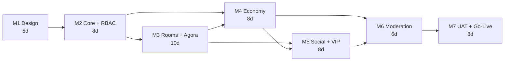

# 05 — Sprint Plan & Risk Register

← [04 Epic Backlog](04-epic-backlog.md) · next → [06 Testing & QA](06-testing-qa.md)

**Contract:** 53 working days · 2 developers · Agile-Scrum with daily standups (SLA §6, §11)
**Backlog estimate:** 1,922 hours = **240 developer-days** ([04 summary](04-epic-backlog.md#summary))

With 2 developers that is **≈120 working days against a contracted 53**. Delivering in 53 would take
roughly **4.5 developers in parallel**. This document still plans every milestone to the contracted 53
days, because that is what was signed — but it does not pretend the arithmetic works. The gap and the
three real ways to close it are in [§9 R-09](#r-09--the-scale-gap).

---

## 1. Team

The contracted shape is 2 developers (SLA §11). Their loads under that shape:

| Who | Focus | Load from [04](04-epic-backlog.md) | Working days |
|---|---|---:|---:|
| **Dev A** | Laravel API, database, realtime, integrations, infrastructure | 1,081 h (BE + RT + INF) | **135** |
| **Dev B** | React Native app **and** Vue admin panel | 770 h (APP + WEB) | **96** |
| Shared | QA authoring, documentation | 71 h | 9 |
| PM / BA | Client calls (2–3/week), scope control, UAT coordination | — | part-time |
| Designer | M1 Figma, then on call for asset delivery | — | M1 + ad hoc |

**Backend is the bottleneck, not the frontends** — 1,081 hours against 770 for both clients combined.
Dev B carrying two toolchains is a real risk ([R-01](#r-01--dev-b-carries-two-clients)), but any
resourcing decision should add backend capacity first. That is a data-driven correction to the
intuitive assumption that two frontends must be the harder half.

The day-by-day plan below allocates work to the contracted two developers. Where a day looks
over-committed, it is because 240 developer-days do not fit into 53 — not because a task was
mis-estimated.

## 2. Cadence

| Ritual | When |
|---|---|
| Daily standup | 15 min, start of day |
| Client progress call | 2–3 per week (SLA §8) — completed, next, blockers |
| Milestone demo | Last day of each milestone, on staging |
| Retro | End of each milestone, 30 min |
| Code review | Every PR, mandatory, before merge (SLA §5.1b) |

## 3. Definition of Done

A ticket is done when **all** of the following hold. Not four of five.

1. Code merged to `develop` after review by the other developer
2. ESLint / Prettier / Pint pass in CI (SLA §5.1a)
3. Unit or feature tests written and passing for the new behaviour
4. OpenAPI annotations updated; the spec regenerates without drift (SLA §5.1c)
5. Every acceptance criterion in [04](04-epic-backlog.md) demonstrably met
6. Deployed to staging and smoke-tested
7. Permission declared on every new admin route (CI-enforced, GFT-332)
8. Any new money path covered by a ledger-integrity test

---

## 4. Milestone schedule

| M | Milestone | Days | Runs | Payment trigger (Annexure B — ⚠ CI-10) |
|---|---|---:|---|---|
| M1 | Design & Prototype | 5 | D1–D5 | Design sign-off |
| M2 | Core Backend & Admin Panel | 8 | D6–D13 | Auth + RBAC + dashboards demo |
| M3 | Audio/Video Rooms & Real-Time | 10 | D14–D23 | Live room demo with two devices |
| M4 | Virtual Economy & Payments | 8 | D24–D31 | End-to-end recharge → gift → payout demo |
| M5 | Social, VIP & Gamification | 8 | D32–D39 | Feature-complete app demo |
| M6 | Moderation, Agency & Notifications | 6 | D40–D45 | Admin platform demo |
| M7 | UAT, Go-Live & Handover | 8 | D46–D53 | UAT sign-off + production deployment |
| | **Total** | **53** | | |

---

## M1 · Design & Prototype (5 days)

**Days 1–5** · SLA deliverables: UI/UX wireframes · clickable prototype · DB schema · architecture
document

**Entry:** signed scope; CI-07 (brand direction) available or approval to originate one.

| Day | Dev A | Dev B |
|---|---|---|
| D1 | Repo, monorepo skeleton, CI pipeline, environment matrix | Design system in Figma — colour, type, spacing, components |
| D2 | Migration authoring from [02](02-database-schema.md) — identity, rooms, economy | Wireframes: onboarding, home, explore, profile |
| D3 | Migrations — gifting, VIP, ranking, agency, moderation, platform | Wireframes: room screen (all seat layouts), gift sheet, wallet |
| D4 | **Agora spike** — token minting, two-device audio join, seat role switch | Wireframes: admin panel — dashboard, users, rooms, moderation, permissions |
| D5 | Seeders, local env verified end to end, architecture doc walkthrough | Clickable prototype assembled; walkthrough with client |

**Exit:** all migrations run clean from scratch and seed · the Agora spike proves two-device audio and
a publisher/subscriber role switch · prototype approved · architecture and schema signed off.

> **D4 is deliberately an Agora spike, not feature work.** M3 is the tightest milestone in the
> contract; discovering an Agora surprise on D14 rather than D4 is what turns a 10-day milestone into
> a 15-day one.

---

## M2 · Core Backend & Admin Panel (8 days)

**Days 6–13** · SLA deliverables: authentication (OTP/social) · user and role management (RBAC) ·
Super Admin and Admin dashboards

**Epics:** A.1, A.2, A.3, **A.11**, D.1, E.4 (build)

**Entry:** M1 exit met; CI-04 credentials for MSG91 and Firebase.

| Day | Dev A | Dev B |
|---|---|---|
| D6 | GFT-001–004 admin auth, Sanctum, MFA | GFT-189 app shell; GFT-008 admin login screen |
| D7 | GFT-114–116 permission tables, resolver, middleware | GFT-009 auth store, interceptors, route guard |
| D8 | **GFT-117 escalation guard**; 118–119 revoke, grantable | GFT-124 permission grant UI |
| D9 | GFT-120–123 scopes, expiry, MFA-on-grant, channel auth | GFT-125–127 sidebar, directive, admin management |
| D10 | GFT-180–183 user auth, OTP via MSG91, social sign-in | GFT-190–191 onboarding, OTP, social buttons |
| D11 | GFT-184–188 profile, avatar, preferences, deletion | GFT-192–193 profile wizard, settings |
| D12 | GFT-023–030 user management, wallet adjustment, sanctions | GFT-031–034 user list, detail, KYC, wallet dialog |
| D13 | GFT-013–018 KPI service, rollups, exports | GFT-019–022 dashboard, charts, export centre |

**Exit:** an admin logs in with MFA · a Super Admin grants a Moderator a scoped permission and the
Moderator's panel reflects it · **GFT-128 escalation suite green** · a user registers by OTP and
completes a profile · dashboards show live KPIs.

**Demo:** create a Moderator, grant three permissions, log in as them, show what they can and cannot
reach — then attempt an escalation by direct API call and show the `403`.

---

## M3 · Audio/Video Rooms & Real-Time (10 days)

**Days 14–23** · SLA deliverables: room creation, multi-seat mic and host controls · Agora voice &
video · 1:1 and group video calling and video seats · in-room chat and reactions

**Epics:** D.2, D.5, E.1, A.4

**Entry:** M2 exit; Agora spike proven in M1; CI-08 concurrency targets ideally known.

**Highest-risk milestone.** ~3 days recovered from M6 (Moderator app removal, DEV-01) are held here
and in M4 as buffer.

| Day | Dev A | Dev B |
|---|---|---|
| D14 | GFT-196–197 room CRUD; GFT-307–308 Agora token service | GFT-310 Agora SDK integration, permissions, audio session |
| D15 | **GFT-198 Redis room-state model** | GFT-212–213 explore and room creation screens |
| D16 | GFT-199–200 join/leave, state snapshot | GFT-214 room screen — seat grid, layouts *(large)* |
| D17 | GFT-201–202 seat operations, host authorisation | GFT-214 continued |
| D18 | GFT-204–205 Reverb channel, events, speaking relay | GFT-215 realtime binding, resync on reconnect |
| D19 | GFT-203 raise-hand; GFT-206–208 chat, announcements, invites | GFT-216–218 seat interactions, raise-hand, chat UI |
| D20 | GFT-209–211 explore, persistence job, host-disconnect grace | GFT-219–220 deep links, connection states |
| D21 | GFT-243–247 call lifecycle, tokens, events | GFT-250–251 Agora wrapper, call UI, ringing |
| D22 | GFT-249 video seats; GFT-036–039 admin room management | GFT-252–254 video rendering, camera controls, adaptive quality |
| D23 | GFT-040–042 categories, themes, limits; buffer | GFT-043–045 admin room screens; GFT-256 video seats |

**Exit:** two physical devices join a room and hear each other · seats, mute, lock, kick, raise-hand
all work and broadcast within 3 s · a 20-second network drop recovers with the seat intact · a 1:1
video call connects with camera flip · an admin force-closes a live room and everyone is evicted ·
**GFT-221 concurrency test green** (no double seat occupancy).

**Demo:** the flagship demo. Three devices, one room, live gifting stubbed, an admin force-close.

---

## M4 · Virtual Economy & Payments (8 days)

**Days 24–31** · SLA deliverables: coin and diamond wallet · gifting with animations · recharge via
gateway · diamond-to-cash payouts

**Epics:** D.6, A.6, A.7, E.3

**Entry:** M3 exit; **CI-01, CI-02, CI-03 answered**; CI-04 Razorpay keys; CI-06 gift assets (at least
a representative set).

| Day | Dev A | Dev B |
|---|---|---|
| D24 | GFT-257–258 wallet, ledger service, locking, immutability | GFT-063–065 gift, VIP and frame managers (admin) |
| D25 | **GFT-259 gift send transaction** — the critical path | GFT-270 gift sheet (app) |
| D26 | GFT-260–262 broadcast, entrance effects, catalogue API | **GFT-271 gift animation engine** |
| D27 | GFT-263–264 Razorpay orders and webhook | GFT-271 continued; GFT-272 entrance effects |
| D28 | GFT-265–266 GST invoices, refunds | GFT-274 recharge flow with checkout |
| D29 | GFT-267–269 withdrawal, history, earnings | GFT-273 wallet screen; GFT-275 withdrawal flow |
| D30 | GFT-066–071 rates, packages, slabs, withdrawal review, batches | GFT-075–077 rates, slabs, withdrawal queue (admin) |
| D31 | GFT-072–074 ledger, reconciliation, nightly job; **GFT-277 money suite** | GFT-078–079 ledger explorer, reconciliation report |

**Exit:** recharge → coins credited by webhook → gift sent → diamonds received → withdrawal requested
→ admin approves → ledger reconciles to zero drift · **GFT-277 green**, including the 500-concurrent-
send test and the webhook-replay test · a GST invoice downloads.

**Demo:** one continuous flow, real sandbox money, ending on the reconciliation report showing zero
discrepancy.

---

## M5 · Social, VIP & Gamification (8 days)

**Days 32–39** · SLA deliverables: profiles, follow and discovery · VIP tiers, levels and rankings ·
events, lucky draws and tournaments

**Epics:** D.3, D.4, D.7, D.8, A.9, B.3, E.5

| Day | Dev A | Dev B |
|---|---|---|
| D32 | GFT-222–227 search, recommendations, follow, friends, presence, profile | GFT-229–232 search, rails, profile, follower lists |
| D33 | GFT-234–237 conversations, messages, media, blocks | GFT-240–241 conversation list, chat screen |
| D34 | GFT-278–280 VIP purchase, privileges, expiry | GFT-286 VIP centre |
| D35 | GFT-281–284 progression, level-up, achievements, check-in | GFT-287–289 progression, achievements, check-in |
| D36 | GFT-096–098 ranking rules, leaderboard engine, reward payout | GFT-294–295 leaderboards, past periods |
| D37 | GFT-092–095 events, rewards, tournaments, lucky draw | GFT-099–101 event builder (admin) |
| D38 | GFT-285 event join and claims; GFT-138–140 Manager submission flows | GFT-290 events hub (app) |
| D39 | GFT-342–343 i18n backend, bilingual content | GFT-344–348 app and web i18n, responsive, accessibility |

**Exit:** VIP purchase applies privileges immediately · three progression tracks update correctly from
real spend and earn · leaderboards populate live and snapshot at period close · an event runs from
schedule to reward payout · full Hindi coverage.

**Descope watchpoint:** if D32–D33 slip, invoke **lever #1 (moments)** here, not later.

---

## M6 · Moderation, Agency & Notifications (6 days)

**Days 40–45** · SLA deliverables: ~~Moderator application~~ **moderation console (DEV-01)** · agency
and host management · FCM notifications, reports and audit logs

**Epics:** A.5, A.8, A.10, B.1, B.2, B.4, B.5, C.1–C.5, D.9, E.2

| Day | Dev A | Dev B |
|---|---|---|
| D40 | GFT-046–051 banned words, filter, reports queue, sanction engine | GFT-052–055 banned words, reports queue, sanction dialog |
| D41 | GFT-150–153 live feed, **silent join**, participant detail, channel auth | GFT-154–156 moderation console, silent-observe view |
| D42 | GFT-157–163 enforcement actions | GFT-163 action bar; GFT-168–169 report review, escalation |
| D43 | GFT-080–087 agencies, hosts, targets, earnings, settlements | GFT-088–091 agency, host, target, settlement screens |
| D44 | GFT-317–323 FCM, SMS, templates, segments, in-app centre | GFT-324–325 app FCM, permission priming; GFT-242 centre |
| D45 | GFT-102–109 banners, campaigns, reports, **audit middleware** | GFT-110–113 banner, campaign, report centre, audit viewer |

**Exit:** a Moderator with only granted permissions works a full shift — monitor, silently observe,
mute, kick, ban, action reports, escalate · every action lands in `moderation_logs` and `audit_logs` ·
agency settlement runs end to end · push notifications arrive on both platforms.

> This milestone was 6 days for an entire second mobile app plus all of this. DEV-01 is what makes it
> achievable. Had the Moderator app stayed, M6 would be the schedule's failure point.

---

## M7 · UAT, Go-Live & Handover (8 days)

**Days 46–53** · SLA deliverables: UAT · production deployment and admin training · source-code
handover and 6-month warranty

| Day | Dev A | Dev B |
|---|---|---|
| D46 | Production infrastructure provisioning ([07 §4](07-devops-deployment.md#4-infrastructure)) | Regression pass across the app; bug list |
| D47 | **Load test** GFT-316 at CI-08 targets; tune | Regression pass across the admin panel; bug list |
| D48 | **Security suite** GFT-340; OWASP sweep; IDOR sweep | Accessibility audit GFT-349; fixes |
| D49 | UAT support — fix critical and high defects | UAT support — fix critical and high defects |
| D50 | UAT support; store build preparation | Play Store and App Store submissions |
| D51 | **Production deployment**; DNS, TLS, monitoring, backups | Production smoke test on real devices |
| D52 | Admin training session; runbook walkthrough | User manual; admin manual finalisation |
| D53 | Source handover, credential transfer, warranty start | Handover checklist sign-off |

**Entry:** all M1–M6 exit criteria met; CI-05 legal content; CI-09 store accounts.

**Exit:** UAT signed off · production live and monitored · both apps submitted · training delivered ·
handover kit accepted ([08](08-handover-amc.md)) · 6-month warranty clock starts.

> **Store review is the one date not under our control.** Apple review for a voice-social app with
> virtual currency commonly takes 3–7 days and frequently comes back with questions. D50 submission
> means approval may land after D53. Mitigation and the IAP exposure are in
> [07 §8](07-devops-deployment.md#8-mobile-release) and [R-04](#r-04--app-store-review-and-iap).

---

## 5. Milestone dependency graph

M4 depends on M3 only for in-room gifting; the wallet, recharge and payout paths could start earlier
if M3 slips. That is the main parallelisation option ([§10](#10-parallelisation-options)).

---

## 6. Buffer accounting

DEV-01 removes the Moderator mobile app from M6. Recovered effort is **not** absorbed silently:

| Source | Recovered | Allocated to |
|---|---|---|
| Moderator app removal (M6) | ~3.5 dev-days | M3 D23 buffer (1.5 d) · M4 D31 buffer (1 d) · M7 defect budget (1 d) |
| Descope levers, if invoked | up to 3 dev-days | held in reserve, requires written client agreement |

---

## 7. Client input deadlines

From [ROADMAP §7](../ROADMAP.md#7-blockers--client-inputs-required). A miss here moves the milestone,
and that is a client-caused delay — flag it on the progress call the day it becomes late, not at the
milestone review.

| Input | Needed by | Blocks if late |
|---|---|---|
| CI-07 brand direction | D1 | M1 |
| CI-04 Agora, Firebase, MSG91 credentials | D6 | M2 D10 (OTP), M3 D14 (Agora) |
| CI-08 concurrency targets | D14 | M3 exit criteria undefined |
| CI-01, CI-02, CI-03 economy config | D24 | **M4 entirely** |
| CI-04 Razorpay keys | D24 | M4 D27 |
| CI-06 gift assets | D24 | M4 D26 animation work |
| CI-05 legal content | D46 | M7 go-live |
| CI-09 store accounts | D46 | M7 D50 submission |

---

## 8. Demo checkpoints

| Milestone | Demo | Client sees |
|---|---|---|
| M1 | Prototype walkthrough | Clickable screens, agreed design language |
| M2 | Permission delegation | Grant a Moderator three permissions live; show the escalation `403` |
| M3 | Live room, three devices | Real audio, seats, gifting stub, admin force-close |
| M4 | Money round-trip | Recharge → gift → earn → withdraw → reconcile |
| M5 | Feature-complete app | VIP, rankings, events, Hindi toggle |
| M6 | Admin platform | A Moderator's full shift; agency settlement |
| M7 | UAT + production | Live system on real infrastructure |

---

## 9. Risk register

Likelihood and impact: **H**igh / **M**edium / **L**ow.

### R-01 · Dev B carries two clients

| | |
|---|---|
| **Risk** | Dev B builds both the React Native app (401 h) and the Vue admin panel (369 h) — 770 hours across two toolchains, two design languages, two review cycles, with constant context switching. |
| **L / I** | **H / M** |
| **Where it bites** | M3 (room screen + admin room screens in the same 10 days) and M6 (moderation console + FCM app work in 6 days). |
| **Mitigation** | Vue screens are assembled from Element Plus rather than hand-built, so the admin panel is assembly not design. Admin work is scheduled on days Dev A is heads-down in backend, so review latency does not compound. |
| **Note** | This was the intuitive risk before the estimate was totalled. The data says **Dev A carries more** (1,081 h vs 770 h). R-01 is real, but [R-09](#r-09--the-scale-gap) is the one that decides the project. |

### R-02 · M3 realtime complexity

| | |
|---|---|
| **Risk** | Agora integration, authoritative seat state, WebSocket fan-out, 1:1 and group video, and video seats — 10 days, two clients. Realtime bugs are non-deterministic and expensive to diagnose. |
| **L / I** | **H / H** |
| **Mitigation** | D4 Agora spike in M1 de-risks the SDK before the milestone starts. Redis-authoritative state with a full-snapshot resync ([01 §4.6](01-architecture.md#46-reconnection)) avoids the entire class of delta-replay bugs. 1.5 buffer days held on D23. |
| **Descope lever** | #4 group video calls (~10 h) — 1:1 calls and room video seats cover the core use case. |
| **Trigger** | If seat operations (GFT-201) are not broadcasting reliably by end of D18, invoke lever #4 immediately rather than at D22. |

### R-03 · M4 financial correctness

| | |
|---|---|
| **Risk** | Double-entry ledger, live gateway, GST invoices and payouts in 8 days. Money bugs are not tolerable defects — a drift of one rupee destroys client confidence more than a week's delay. |
| **L / I** | **M / H** |
| **Mitigation** | Ledger contract frozen in M1 ([02 §15](02-database-schema.md#15-money-integrity-rules)). Razorpay sandbox wired in M2 spare capacity. GFT-277 money suite runs in CI from D25, not at the end. 1 buffer day on D31. |
| **Descope lever** | GST invoice generation (GFT-265) can move to M7 if the milestone is at risk — coins still credit correctly, invoices arrive a fortnight later. Requires client agreement since E.3c is contracted. |
| **Non-negotiable** | The ledger integrity tests. No descope, no deferral, no exception. |

### R-04 · App Store review and IAP

| | |
|---|---|
| **Risk** | Apple's guideline 3.1.1 requires in-app purchase for digital content consumed within the app. Coins bought via Razorpay to send virtual gifts is exactly the pattern Apple scrutinises. Rejection is plausible; it is not certain, since some social-gifting apps ship with external payment in India. |
| **L / I** | **M / H** |
| **Impact if it lands** | Implementing StoreKit IAP is roughly 5–8 developer-days plus Apple's 30% commission changing the unit economics. It is **out of scope** ([00 §8](00-overview.md#8-out-of-scope)) and would be a Change Request. |
| **Mitigation** | Submit on D50 to get review feedback inside the engagement. Prepare the review-notes package in advance ([07 §8](07-devops-deployment.md#8-mobile-release)). Android is unaffected and can go live independently. |
| **Action** | Raise this with the client in **M1**, not M7. They may already have a commercial position on it. |

### R-05 · Client inputs arriving late

| | |
|---|---|
| **Risk** | Ten client inputs gate the schedule; CI-01/02/03 gate M4 entirely. |
| **L / I** | **M / H** |
| **Mitigation** | Everything is built configurable and seeded with placeholders, so real values require no code change. The deadline table in [§7](#7-client-input-deadlines) is reviewed on every progress call. |
| **Escalation** | If an input is 2 days late, it goes on the call agenda as a schedule risk with the milestone named. |

### R-06 · Concurrency targets unknown

| | |
|---|---|
| **Risk** | CI-08 is unanswered. Architecture is sized for a provisional 5,000 concurrent users / 300 rooms. A target an order of magnitude higher changes the infrastructure and possibly the realtime design. |
| **L / I** | **M / M** |
| **Mitigation** | Reverb scales horizontally; Redis and MySQL are managed and resizable. The provisional target is stated in NFR-04 so it is visibly an assumption, not a promise. |
| **Action** | Confirm by D14. If the real target exceeds 20,000 concurrent, the infrastructure plan is revisited as a CR. |

### R-07 · Gift animation assets

| | |
|---|---|
| **Risk** | CI-06 — SVGA/Lottie gift artwork is client-supplied. Late or oversized assets stall the animation engine work on D26. |
| **L / I** | **M / M** |
| **Mitigation** | The engine is built against placeholder animations from D26; real assets drop in without code change. File-size and format constraints are documented and sent to the client in M1. |

### R-08 · Scope creep during sprints

| | |
|---|---|
| **Risk** | Mid-sprint feature requests on a 53-day contract. |
| **L / I** | **H / M** |
| **Mitigation** | [00 §8](00-overview.md#8-out-of-scope) is the boundary. Anything outside it is estimated as a CR at Rs. 475/hour with written approval before work starts (SLA §9.3). |
| **Discipline** | "Yes, and here is the CR estimate" — never "yes" alone. Absorbing small requests silently is how the 53 days becomes 73 without anyone deciding it should. |

### R-09 · The scale gap

**The defining risk of this engagement. Everything else is secondary.**

| | |
|---|---|
| **Risk** | The bottom-up estimate is **240 developer-days** ([04](04-epic-backlog.md#the-estimate-against-the-contract)) against a **53-working-day, 2-developer** contract. Two developers deliver this in ≈120 working days. Delivering in 53 needs ≈4.5 developers in parallel. |
| **L / I** | **H / H** — this is not a risk of overrun, it is a certainty of overrun under the current shape. |
| **Why the plan still runs to 53** | The client signed 53 and this document honours that commitment milestone by milestone. The estimates in [04](04-epic-backlog.md) are deliberately **not** shaved to make the arithmetic agree. A plan that misstates its own size cannot be managed, and the overrun surfaces anyway — just later, and as a failure rather than a decision. |
| **Why the estimate is credible** | It is derived from the SLA's own 34 user stories, ticket by ticket, with the Moderator app already removed. A voice-social platform with live audio rooms, video calling, a double-entry economy with payouts, gamification, agency management and a full admin platform is a 12-month-plus product for a small team in the industry generally. 240 developer-days is not a padded number. |
| **What does *not* close the gap** | The [descope levers](04-epic-backlog.md#descope-levers) recover ~48 h — **2.5%**. They absorb a slipped milestone. Presenting them as a solution to a 187-day shortfall would be misleading. |

#### The three real options

| Option | What it means | Result |
|---|---|---|
| **1. Add developers** | Go to 5 developers (2 backend, 1 React Native, 1 Vue, 1 shared QA/backend) for M2–M6 | Closest to the contracted 53 days. Parallelism has coordination overhead, so budget ~60–65 days realistically. **Recommended.** |
| **2. Extend the timeline** | Keep 2 developers | ≈120 working days ≈ 5.5 months. Honest, low-risk, but a very different commercial commitment. |
| **3. Reduce V1** | Ship a genuine MVP in 53 days with 2 developers | See the cut below. Requires a signed revision to the scope, not a descope lever. |
| ~~4. Compress by working harder~~ | — | **Not an option.** A 2.3× compression is delivered by cutting testing, review and hardening — precisely the M7 activities that protect money and user safety. Say no to this one explicitly. |

#### If option 3 — what a 53-day / 2-developer V1 actually contains

Roughly 106 developer-days of the 240. Everything else moves to V1.1:

| Ships in V1 | Deferred to V1.1 |
|---|---|
| Auth, profiles, RBAC + delegation (A.1, A.3, A.11, D.1) | Video calling entirely (D.5) |
| Audio rooms, seats, host controls, chat (D.2) | Agency, hosts, targets, settlements (A.8, D.9a–b) |
| Agora audio only (E.1 audio) | Events, tournaments, lucky draws (A.9, D.7d) |
| Wallet, gifting, recharge, withdrawal (D.6, A.7, E.3) | Moments, DMs (D.3d, D.4) |
| Basic moderation — reports, sanctions, force-close (A.5, C.1–C.3) | Manager role in full (FR.B) |
| Core admin — users, rooms, gifts, dashboard (A.2, A.4, A.6) | VIP, levels, rankings (D.7, D.8, A.9c) |
| Push notifications (E.2) | CMS, campaigns, advanced reports (A.10) |

**Recommendation:** put options 1 and 2 to the client at the **M1 review (day 5)**, with the ticket
breakdown in [04](04-epic-backlog.md) as the evidence. A resourcing conversation on day 5 is a
planning decision. The identical conversation on day 40 is a crisis, and by then the only remaining
lever is the one that should never be pulled.

---

## 10. Parallelisation options

If additional capacity is approved ([R-09](#r-09--the-scale-gap) option 1), the work splits cleanly
along these seams — in priority order:

| Add | What moves to them | Removes from the critical path |
|---|---|---:|
| **2nd backend dev** (highest value) | Economy domain: GFT-257–277, 066–079, plus E.3 integrations | ~55 days of Dev A's 135 |
| **Dedicated Vue dev** | All 62 WEB tickets, M2–M6 | ~46 days of Dev B's 96 |
| **3rd backend dev** | Moderation + agency domains: A.5, A.8, C.1–C.5, B.* | ~30 days of Dev A's remainder |
| Dedicated QA from M3 | GFT-128, 221, 277, 316, 340 plus regression | ~8 days, mostly from M7 |
| Designer through M3 | Room-screen assets and states delivered before build | ~2 days of Dev B rework |

Independent seams that parallelise without new people: M4's wallet, recharge and payout paths depend
on M3 **only** for in-room gifting, so they can start at D18 if M3 slips.

## 11. Change Request handling

Per SLA §9.3: estimated via the CR process, **written approval before development**, Rs. 475/hour.

1. Log the request with the date and requester.
2. Estimate in hours against the [04](04-epic-backlog.md) ticket format, including test and doc effort.
3. State the schedule impact explicitly — which milestone moves and by how many days.
4. Obtain written approval by email.
5. Only then schedule it, as new tickets, into a named milestone.

A CR that is approved but not scheduled is a CR that will be blamed on the delivery team. Always name
the milestone. Template in [08 §6](08-handover-amc.md#6-change-request-process).
